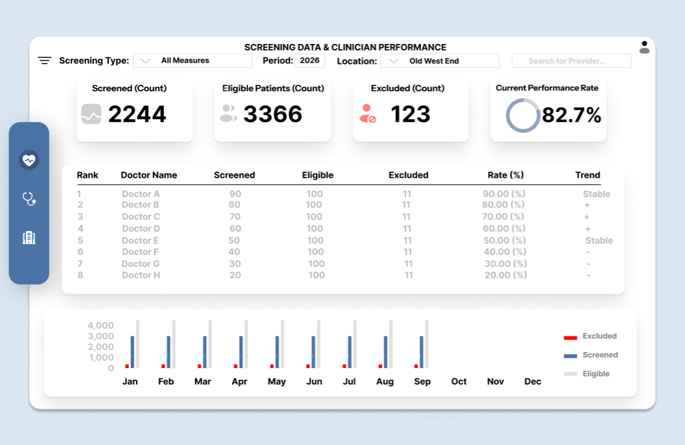

# Dashboard Wireframe Overview

A wireframe is a blueprint for a dashboard. It lays out and maps out where every chart, table, and filter goes before anything is built in a dashboard software like Power BI or Tableau. When deciding the layout, it helps make the data more digestible if you add on different elements and model it out. 

I started by identifying the exact numbers that drive decisions—screened patients, eligible patients, rates, etc. Then I built a clear visual hierarchy: big-picture KPIs sit right at the top for an instant status check, followed by a table of a provider leaderboards that give deeper context, and then a clustered vertical bar chart by month at the bottom. 

[Open Dashboard Wireframe in Figma](https://www.figma.com/design/ihoIVAm64YWzBZCZqFUi3m/Screening-Data-and-Doctor-Performance?node-id=0-1&t=GJMdgSKT1T7oXOiY-1)

